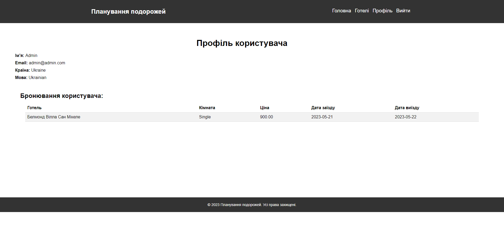

# Проект "Бронирование комнат в отелях"

## Описание проекта и его функционал
Проект создан для бронирования комнат в отелях, которые хранятся в базе данных. Он включает в себя систему авторизации, возможность бронирования комнат и отображение доступных комнат в каждом отеле.

# Скриншоты

### Главная страница


### Страница списка отелей


### Страница определенного отеля


### Страница профиля


# Инструкции по установке
- Клонируйте репозиторий с GitHub.
```bash Copy code
git clone https://github.com/An0n1myS/movement_web-site.git
```
- Установите все зависимости Python.
```
pip install -r requirements.txt
```
- Экспортируйте базу данных, которая находится в корне проекта.
- Измените данные подключения к базе данных в соответствии с вашей конфигурацией.
- Запустите проект.

##Список зависимостей
- Flask
- pymysql
- secrets
- base64
